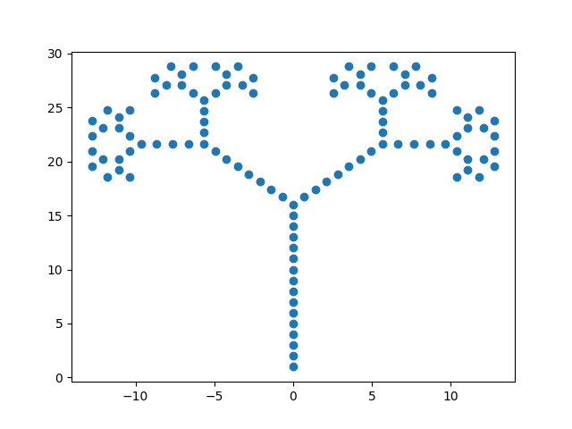
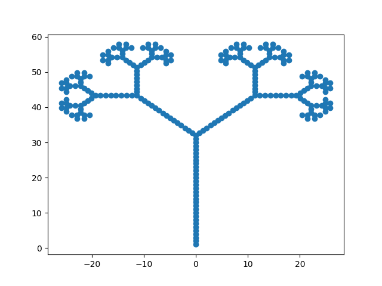
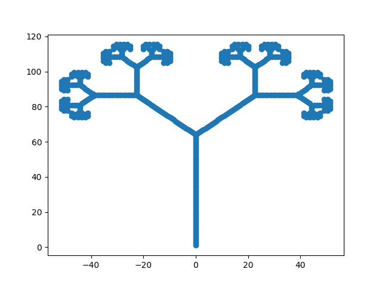

# linsys

[Lindenmayer systems](https://en.wikipedia.org/wiki/L-system) in python.

## Usage

Specify an L-system by its production rules

```python
>>> algae = Lsys({'A': 'AB'})
```

Alphabet consisting of both variables and constants is inferred from the rules.

```python
>>> algae.variables() == {'A'}
True
>>> algae.constants() == {'B'}
True
>>> algae.alphabet() == {'A', 'B'}
True
```

Apply the (for now) single rule

```python
>>> algae('A')
'AB'
```

Add another production rule

```python
>>> algae['B'] = 'A'
>>> algae.variables() == {'A', 'B'}
True
```

Apply the production rules to some string

```python
>>> algae('AB')
'ABA'
```

Or iterate over the applications of rules

```python
for i, state in enumerate(algae.iter('A')):
    print(i, state)
```

yielding

```sh
0 A
1 AB
2 ABA
3 ABAAB
4 ABAABABA
5 ABAABABAABAAB
6 ABAABABAABAABABAABABA
7 ABAABABAABAABABAABABAABAABABAABAAB
...
```

## Visualize

A turtle eats the generated string and its trace can be used to visualize it. See [example](linsys/vision.py).

### Fractal tree








### Koch Curves

![1][out/koch1.png]

![2][out/koch2.png]

![3][out/koch3.png]

![4][out/koch4.png]

![5][out/koch5.png]
